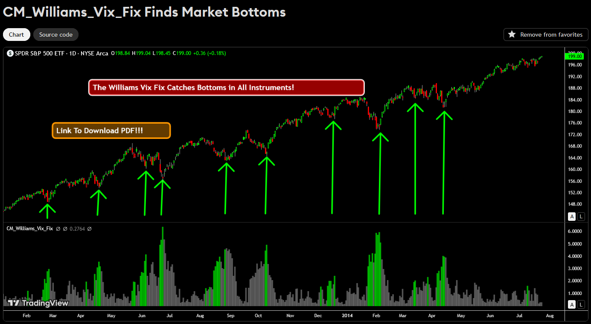

# Market Bottoms Notifier

This application fetches 4-hour candles for IWDA and VWCE ETFs, applies the Williams Vix Fix indicator, and sends a Telegram notification if it's a good day to buy.

## Indicator Example



## Features
- Fetches 4h candles for:
  - IWDA (iShares Core MSCI World UCITS ETF)
  - VWCE (Vanguard FTSE All-World UCITS ETF USD ACCUMULATING)
- Runs the Williams Vix Fix indicator logic
- Sends a Telegram message if a market bottom is detected

## Setup

### 1. Clone or upload the project to your server

### 2. Install dependencies
```
pip install -r requirements.txt
```

### 3. Configure environment variables
Create a `.env` file in the project root with:
```
TELEGRAM_BOT_TOKEN=your_telegram_bot_token
TELEGRAM_CHAT_ID=your_telegram_chat_id
```

### 4. (Optional) Create a shell script to run the app
Create `run_app.sh`:
```bash
#!/bin/bash
cd /path/to/your/project
/usr/bin/python3 app.py
```
Make it executable:
```
chmod +x run_app.sh
```

### 5. Schedule with cron (Linux)
Edit your crontab:
```
crontab -e
```
Add this line to run every day at 22:00 (10:00 PM):
```
0 22 * * * /path/to/your/project/run_app.sh >> /path/to/your/project/app.log 2>&1
```
Or, run the Python script directly:
```
0 22 * * * cd /path/to/your/project && /usr/bin/python3 app.py >> app.log 2>&1
```

## Notes
- Ensure your server has Python 3 and pip installed.
- The Telegram bot must be created and the chat ID obtained in advance.
- Logs are written to `app.log` for troubleshooting.

---

Feel free to modify the schedule or add more indices as needed.
